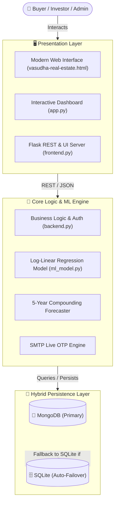

<!-- ============================================================================== -->
<!-- 🌌 VASUDHA REAL ESTATE (वसुधा) — REPOSITORY README -->
<!-- ============================================================================== -->

<p align="center">
  
</p>

<p align="center">
  <a href="https://github.com/OMPATEL0512/Vasudha-Real-Estate-Price-Prediction">
    
  </a>
</p>

<p align="center">
  
  
  
  
  
  
  
  
  
</p>

---

## 📖 Overview

**Vasudha Real Estate (वसुधा)** is an enterprise-grade AI/ML property valuation and investment intelligence platform engineered specifically for **Ahmedabad, Gujarat, India**. 

It empowers home buyers, real estate investors, and developers with:
- Instant property valuations calculated from multi-factor regression models ($R^2 = 0.997$).
- **5-Year Compounding Capital Appreciation Forecasts** based on historical micro-market CAGRs (2020–2026+).
- Real-time **Locality Comparison Radar** across 29+ prime Ahmedabad corridors.
- Secure **Email OTP verification**, **Mortgage EMI calculation**, and **PDF / Email Report Dispatch**.

---

## ✨ Key Features & Capabilities

<table>
  <tr>
    <td width="50%">
      <h3>🤖 AI Property Valuation Engine</h3>
      <ul>
        <li><b>High-Precision ML:</b> Log-Linear Fixed-Effects Regression achieving <b>R² = 0.997</b>.</li>
        <li><b>Flexible Area Units:</b> Support for both <b>Sq. Yards (Gaj)</b> and <b>Sq. Feet</b>.</li>
        <li><b>Property Multipliers:</b> Dynamic weighting for Apartments, Tenements, Duplexes, and Commercial units.</li>
      </ul>
    </td>
    <td width="50%">
      <h3>📈 5-Year Capital Forecasts</h3>
      <ul>
        <li><b>Multi-Year Compounding ROI:</b> Year-by-year value projections through 2031.</li>
        <li><b>Locality CAGR Modeling:</b> Uses real observed appreciation rates per corridor (6.2% to 15.8%).</li>
        <li><b>Total Appreciation Breakdown:</b> Estimated net capital gains and annualized ROI.</li>
      </ul>
    </td>
  </tr>
  <tr>
    <td width="50%">
      <h3>⚖️ Micro-Market Benchmarking</h3>
      <ul>
        <li><b>Side-by-Side Comparison:</b> Compare up to 4 localities simultaneously.</li>
        <li><b>Luxury Leaderboard:</b> SBR, Bodakdev, Ambli, and Science City rate index.</li>
        <li><b>Price Trend Visualizer:</b> Interactive charts displaying 2020–2026 historical rates.</li>
      </ul>
    </td>
    <td width="50%">
      <h3>🛡️ Enterprise Security & Database</h3>
      <ul>
        <li><b>Hybrid DB Architecture:</b> Primary <b>MongoDB</b> with zero-downtime <b>SQLite</b> failover.</li>
        <li><b>Live OTP Authentication:</b> SMTP email OTP delivery for registration and password resets.</li>
        <li><b>OWASP Protection:</b> Hashed passwords (`Werkzeug`), sanitized SQL/Mongo inputs, CSRF defenses.</li>
      </ul>
    </td>
  </tr>
</table>

---

## 🗺️ Ahmedabad Locality Coverage (29+ Micro-Markets)

```
╔══════════════════════════════════════════════════════════════════════════════════════════════╗
║  Sindhu Bhavan Road (SBR)  •  Bodakdev      •  Ambli        •  Thaltej       •  Satellite    ║
║  SG Highway Corridors      •  Prahlad Nagar •  Science City •  Vastrapur     •  Shela        ║
║  South Bopal               •  Bopal         •  Vaishnodevi  •  Shilaj        •  Gota         ║
║  Motera                    •  Chandkheda    •  Jagatpur     •  Tragad        •  Zundal       ║
║  Chandlodiya               •  Paldi         •  Ellisbridge  •  Navrangpura   •  Maninagar    ║
║  Nikol                     •  Naroda        •  Vatva        •  Odhav         •  Isanpur      ║
╚══════════════════════════════════════════════════════════════════════════════════════════════╝
```

---

## 🏗️ System Architecture



---

## 💻 Tech Stack

<p align="center">
  
</p>

| Layer | Technologies |
| :--- | :--- |
| **Backend & APIs** | Python 3.10+, Flask 3.0+, Werkzeug Security, Gunicorn |
| **Machine Learning** | Scikit-Learn (Log-Linear Fixed Effects), NumPy, Pandas, Joblib |
| **Interactive UI** | Streamlit, Vanilla HTML5 / Modern CSS3 (Cinzel & Outfit typography), JavaScript |
| **Databases** | MongoDB (PyMongo) + SQLite3 (Native Auto-Failover) |
| **Authentication** | SMTP Live Email OTP, SHA-256 / Werkzeug password hashing |

---

## 🚀 Quick Start Guide

### 1. Clone the Repository
```bash
git clone https://github.com/OMPATEL0512/Vasudha-Real-Estate-Price-Prediction.git
cd Vasudha-Real-Estate-Price-Prediction
```

### 2. Set Up Virtual Environment & Dependencies
```bash
python -m venv venv

# Windows:
.\venv\Scripts\activate

# macOS / Linux:
source venv/bin/activate

# Install dependencies:
pip install -r requirements.txt
```

### 3. Configure Environment Variables
```bash
cp .env.example .env
```
*(Optionally add your SMTP email credentials in `.env` for live OTP delivery).*

### 4. Run the Application

* **Option A — Web Application (Flask + Modern UI):**
  ```bash
  python frontend.py
  # Open http://127.0.0.1:5000 in your browser
  ```

* **Option B — Streamlit Interactive Analytics Dashboard:**
  ```bash
  streamlit run app.py
  # Open http://localhost:8501 in your browser
  ```

* **Option C — Windows 1-Click Launcher:**
  Simply double-click [`run_app.bat`](file:///c:/Users/ompat/Desktop/VASUDHA%20REAL%20ESTATE%20PRICE%20PREDICTION/VASUDHA%20REAL%20ESTATE%20PRICE%20PREDICTION/run_app.bat)!

---

## 🧪 Automated Testing

The platform includes an automated unit & integration test suite verifying authentication, OTP dispatch, valuation calculations, and database failover:

```bash
python test_vasudha.py
```
```
----------------------------------------------------------------------
Ran 12 tests in 0.514s

OK (12/12 Tests Passing)
```

---

## 📡 REST API Reference

| Method | Endpoint | Description |
| :---: | :--- | :--- |
| `POST` | `/api/predict` | Calculate instant property valuation & 5-year forecast |
| `GET` | `/api/localities` | Retrieve full list of Ahmedabad localities and base rates |
| `POST` | `/api/compare` | Multi-locality benchmark and appreciation comparison |
| `POST` | `/api/auth/register` | Start user registration & send 6-digit email OTP |
| `POST` | `/api/auth/verify-otp` | Verify registration OTP and activate account |
| `POST` | `/api/auth/login` | Authenticate user credentials & create session |
| `POST` | `/api/auth/forgot-password` | Initiate password reset & dispatch reset OTP |
| `POST` | `/api/share-valuation` | Send comprehensive property report directly via Email |

---

## 👨‍💻 Author

<p align="center">
  <b>Om Patel</b><br/>
  <i>Full Stack & AI Developer | Machine Learning Enthusiast</i>
</p>

<p align="center">
  <a href="https://github.com/OMPATEL0512"></a>&nbsp;&nbsp;
  <a href="https://linkedin.com/in/om-patel"></a>&nbsp;&nbsp;
  <a href="mailto:ompatel94929@gmail.com"></a>
</p>

---

<p align="center">
  
</p>
