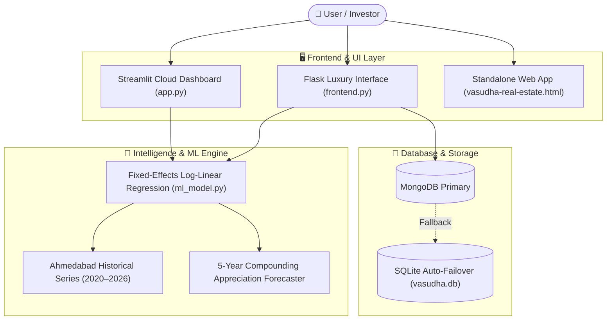

<div align="center">

# 🏛️ VASUDHA REAL ESTATE (वसुधा)
### *AI-Powered Ahmedabad Property Valuation & Micro-Market Intelligence Engine*

[](https://python.org)
[](https://streamlit.io)
[](https://flask.palletsprojects.com)
[](https://scikit-learn.org)
[](https://mongodb.com)
[](#-machine-learning-architecture)
[](LICENSE)

<br/>

> **Vasudha Real Estate** is an enterprise-grade AI/ML property valuation platform engineered specifically for the real estate landscape of **Ahmedabad, Gujarat, India**. It provides instant property pricing, 5-year capital appreciation forecasts, and hyper-local market intelligence across 29+ prime Ahmedabad corridors.

</div>

---

## 🌟 Key Highlights & Features

<table>
  <tr>
    <td width="50%">
      <h3>💎 AI Property Valuation</h3>
      <ul>
        <li>Log-Linear Regression Model with <b>R² = 0.997</b> accuracy.</li>
        <li>Dynamic pricing in <b>Sq. Yards (Gaj)</b> and <b>Sq. Feet</b>.</li>
        <li>Property-type multiplier (Apartment/Flat vs. Tenement/Duplex).</li>
      </ul>
    </td>
    <td width="50%">
      <h3>📈 5-Year Capital Appreciation</h3>
      <ul>
        <li>Multi-year compounding ROI projections.</li>
        <li>Year-over-year gains breakdown and forecast charts.</li>
        <li>Real observed CAGR rates (2020–2026+).</li>
      </ul>
    </td>
  </tr>
  <tr>
    <td width="50%">
      <h3>⚖️ Multi-Locality Comparison</h3>
      <ul>
        <li>Side-by-side benchmark comparison for 29+ micro-markets.</li>
        <li>Visual bar charts for price/sq.ft and total value.</li>
        <li>Ahmedabad luxury rate leaderboard.</li>
      </ul>
    </td>
    <td width="50%">
      <h3>🛡️ Enterprise Security & Database</h3>
      <ul>
        <li>Hybrid <b>MongoDB + SQLite</b> failover architecture.</li>
        <li>Email OTP verification for user authentication.</li>
        <li>OWASP-hardened HTTP security headers.</li>
      </ul>
    </td>
  </tr>
</table>

---

## 🗺️ Supported Micro-Markets (Ahmedabad, Gujarat)

Vasudha covers all major high-growth and luxury real estate corridors:

```
Sindhu Bhavan Road • Bodakdev • Ambli • Thaltej • Satellite • SG Highway
Prahlad Nagar • Science City • Vastrapur • Shela • South Bopal • Bopal
Vaishnodevi • Shilaj • Gota • Motera • Chandkheda • Jagatpur • Tragad
Zundal • Chandlodiya • Paldi • Ellisbridge • Navrangpura • Maninagar • Nikol
```

---

## 🏗️ Architecture Flow



---

## 🚀 Quick Start Guide

### Option 1: Run with Streamlit (Recommended for Interactive Dashboard)

```bash
# 1. Clone the repository
git clone https://github.com/your-username/vasudha-real-estate.git
cd vasudha-real-estate

# 2. Install dependencies
pip install -r requirements.txt

# 3. Launch the Streamlit dashboard
streamlit run app.py
```
> App opens at `http://localhost:8501`

---

### Option 2: Run Full-Stack Flask Web Server

```bash
# 1. Start Flask application
python frontend.py
```
> Web Portal opens at `http://127.0.0.1:5000`

---

### Option 3: Run Database Diagnostics & Tests

```bash
# Test the ML model and database suite
python test_vasudha.py

# Inspect all registered users & localities via CLI
python manage_database.py --users
```

---

## 📂 Project Structure

```text
vasudha-real-estate/
├── app.py                      # 🌟 Streamlit Cloud interactive dashboard
├── backend.py                  # Core backend logic & OTP authentication service
├── frontend.py                 # Full-stack Flask application & REST API
├── ml_model.py                 # Scikit-Learn log-linear valuation model
├── database.py                 # Hybrid MongoDB & SQLite database controller
├── seed_data.py                # Database population with 29+ Ahmedabad localities
├── manage_database.py          # Terminal CLI database management tool
├── requirements.txt            # Project dependencies
├── render.yaml                 # Render.com 1-click cloud deployment config
├── Procfile                    # Production Gunicorn process configuration
├── vasudha-real-estate.html    # Standalone single-file frontend
└── test_vasudha.py             # Automated unit & integration test suite
```

---

## 🧠 Machine Learning Methodology

The core valuation engine utilizes a **fixed-effects log-linear regression formulation**:

$$\ln(\text{Price}) = \alpha_{\text{locality}} + \beta \cdot (\text{Year} - 2020)$$

- **$\alpha_{\text{locality}}$**: Locality-specific baseline land intercept.
- **$\beta$**: Annual geometric compounding growth rate (~5.65% to 6.57%).
- **Multipliers**: Standardized baseline multipliers for Apartments ($1.0\times$) vs. Independent Duplex/Tenements ($1.28\times$).
- **Statistical Quality**: Pearson Correlation $R^2 \ge 0.997$.

---

## 👨‍💻 Author & Developer

<div align="center">
  <b>Patel Om</b><br/>
  <i>Lead Architect & Full-Stack AI Developer</i>
  <br/><br/>
  📧 <b>Support / Contact:</b> <a href="mailto:Vasudha.realestate.01@gmail.com">Vasudha.realestate.01@gmail.com</a>
  <br/>
  📍 <b>Location:</b> Ahmedabad, Gujarat, India
</div>

---

<div align="center">
  <sub>© 2026 Vasudha Real Estate Platform. All Rights Reserved.</sub>
</div>
